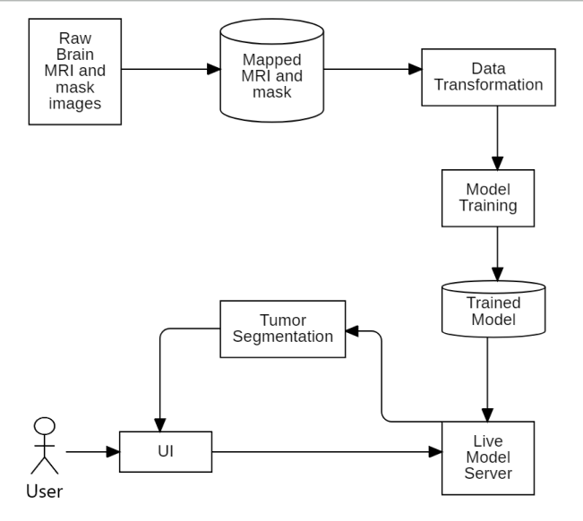
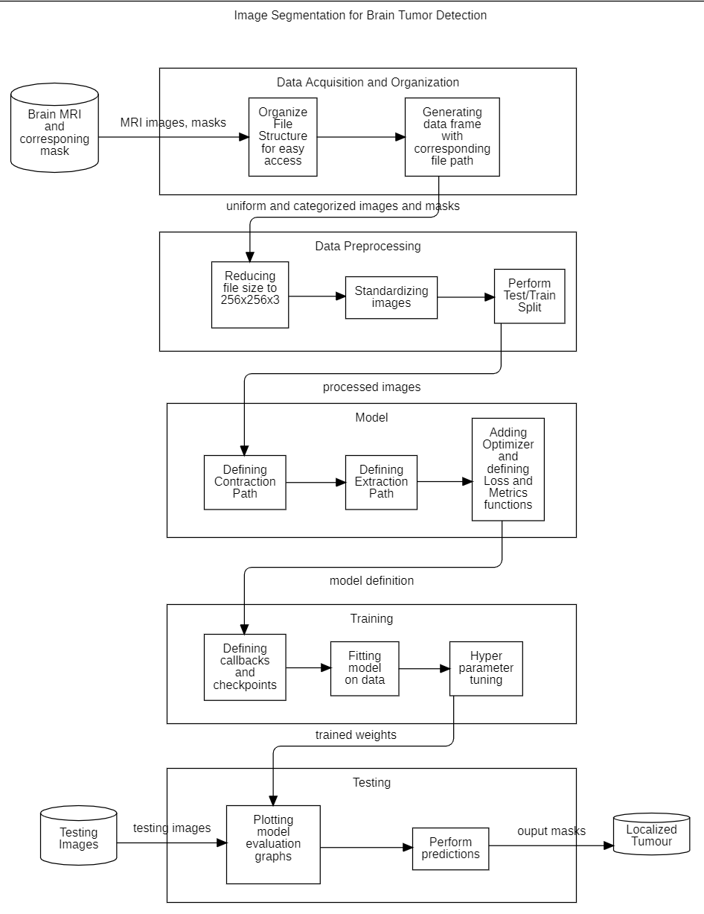
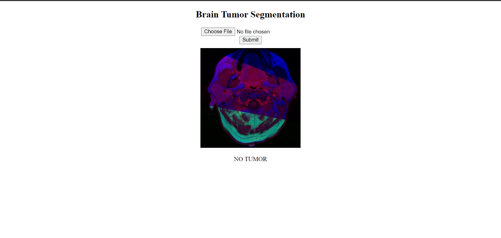
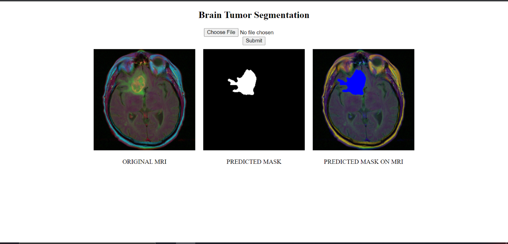

# Brain MRI Tumor Segmentation

A **Convolution Neural Network** based **Brain MRI Tumor Segmentation**.

**U-Net** architecture is used for the segmentation task.

Developed using `Python` and `Tensorflow`

## Methodology
We make use of a convolution neural network architecture that consists of a contracting path to
capture context and a symmetric expanding path that enables precise localization of the tumor

This type or architecture provides several advantages for segmentation tasks:
- This model allows for the use of global location and context at the same time
- It works with very few training samples and provides better performance for segmentation tasks

## Project Architecture
| Overall Architecture | Module-Wise Architecture |
:-------------------------:|:-------------------------:
 | 

## Web App
| MRI Upload | Segmentation Results |
:-------------------------:|:-------------------------:
 | 

